# 
Notizblock

## Vorwort
Dies ist eine Beta version eines Onlineblocks.  
Die anwendung ist zuzeit nur für den Hausgebrauch gedacht, doch in zukunft wird sich das änden.  
Der Server ist für das Notieren und übersichtliche darstellen von informationen.  

## Beispiel

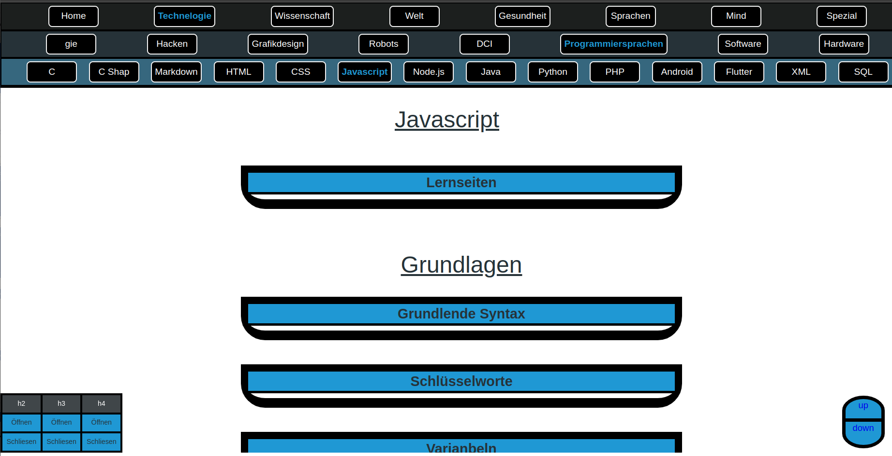

Dies ist nur ein beispiel wie es aussehen kann.  
Wie und mit welchen Themen sie Ihre seiten fühlen ist ihnen Überlassen.  

---
## Aufbau

Befassen wir uns nun mit dem Aufbau.

1. Alles Baut auf die oberen Kategorien und Unterkategorien auf.
- Die Oberste Reihe zeigt die Hauptthemen.  
Das Blaue Thema ist offen.  
Die untren Reihen sun die Unter Themen.

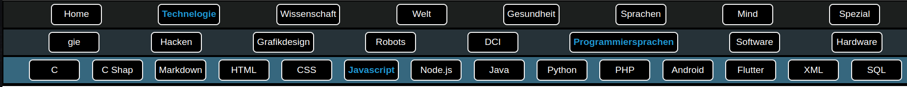

- Unterkategorien öffnen sich beim hovern der Maus über ein Thema

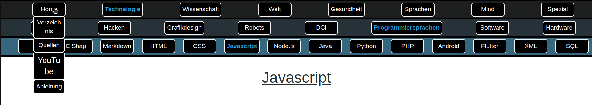

2. Die Infomationen werden auf der seite in Blöcken eingeschlossen.
- Diese Blöcke gib es in verschiedenen Designs und sind auf/zuklapbar.

---
## Beabeitung

### seiten
#### **Start**
In dem man 3 Sekunden auf eine Element gedrückt hält, werden die bearbeitung Funktionen geöffnet.

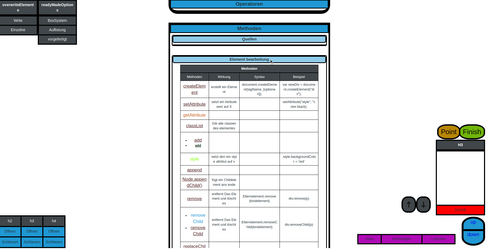

---
#### **Element Selektieren**
Unten Rechts sieht man  die **Selectionsbar**.
|1|2|3|4|
|-|-|-|-|
|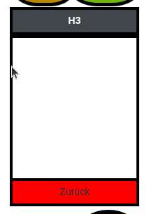|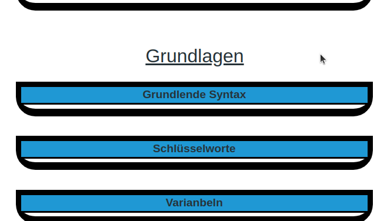|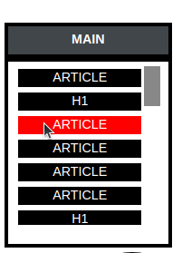|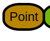|
1. Bild
- Im scharzen Feld sieht man das fokusierte Element.
- Unten in rot sieht man den "Zurück" Button um zum Eltern Element zu kommen.
2. Bild
- Zu demonstrations Zweg fokusierte ich ein anderes Element.
3. Bild
- Durch das fokusieren auf ein Element mit inhalt sieht man die darin befindenen Elemente
- Diese kann man durch ein klick halb fokusieren
- mit dem 2 klick auf den halb fokusierten Element kann man es ganz fokusieren (hinein navgieren)
4. Bild
- Durch das anklicken des "point" Button wird das nächste Element was angeklickt wird fokusiert.
- Es gibt zurzeit keine möglichkeit es abzubrechen, einmal geklick muss es einmal ausgeführt werden. (Wird in zukunft behoben)
---
#### **Element Erzeugung**
Die erzeugung von Elementen wird durch eine Palete vorgefertigter Elemente zu verfügung gesetzt.  

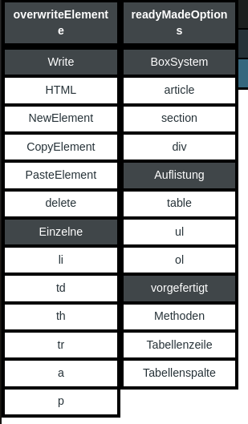
  

Die verschiedenen Reiter sind:  
|1|2|3|4|5|
|-|-|-|-|-|
|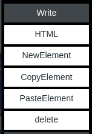|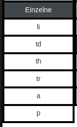|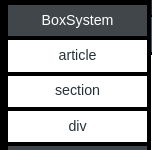|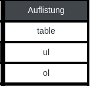|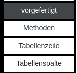|  

1. Bild
- HTML:  
Öffnet ein eingabefeld mit dem HTML inhalt des fokusierten objects
- NewElement:  
Öffnet im Fokuselement ein Eingabefeld, in dieses muss das element eigegeben werden was man erstellen möchte.  
**Fals halbfokus aktiv, wird das Element über das halb Fokusierte Element gesetzt.**
- CopyElement:  
Kopiert den **HTML Code** das fokusierte/halbfokusierte Elements
- PasteElement:  
Öffnet im Fokuselement ein eingabefeld, in dieses kommt der Kopierte **HTML Code**.  
**Fals halbfokus aktiv, wird das Element über das halb Fokusierte Element gesetzt.**
- delete:  
Löscht das fokusierte/halbfokus Element
2. Bild
- li:  
Öffnet ein Eingabefeld, in diese müssen sie die anzahl eigeben der zu erzeugenden Listen Elemente.  
**Fals halbfokus aktiv, wird das Element über das halb Fokusierte Element gesetzt.**
- td:  
Öffnet ein Eingabefeld, in diese müssen sie die anzahl eigeben der zu erzeugenden Tabellenzellen Elemente.  
**Fals halbfokus aktiv, wird das Element über das halb Fokusierte Element gesetzt.**
- th:  
Öffnet ein Eingabefeld, in diese müssen sie die anzahl eigeben der zu erzeugenden Tabellenkopfzellen Elemente.  
**Fals halbfokus aktiv, wird das Element über das halb Fokusierte Element gesetzt.**
- tr:  
Erzeugt eine tabellen zeile.  
**Fals halbfokus aktiv, wird das Element über das halb Fokusierte Element gesetzt.**
- a:  
erzeugt ein link und frag nach der url.  
**Fals halbfokus aktiv, wird das Element über das halb Fokusierte Element gesetzt.**
- p:  
Erzeugt ein Text Element.  
**Fals halbfokus aktiv, wird das Element über das halb Fokusierte Element gesetzt.**
3. Bild
- article:  
Erzeugt ein Hauptblock.  
**Fals halbfokus aktiv, wird das Element über das halb Fokusierte Element gesetzt.**
- section:  
Erzeugt ein block.  
**Fals halbfokus aktiv, wird das Element über das halb Fokusierte Element gesetzt.**
- div:  
Erzeugt ein Unterblock.  
**Fals halbfokus aktiv, wird das Element über das halb Fokusierte Element gesetzt.**
4. Bild
- table:  
Öffnet ein Eingabefeld, in diese müssen sie die anzahl eigeben der zu erzeugenden Spalten in der Tabelle.  
**Fals halbfokus aktiv, wird das Element über das halb Fokusierte Element gesetzt.**
- ul:  
Öffnet ein Eingabefeld, in diese müssen sie die anzahl eigeben der zu erzeugenden Listen Elemente in der unsortierten Liste.  
**Fals halbfokus aktiv, wird das Element über das halb Fokusierte Element gesetzt.**
- ol:  
Öffnet ein Eingabefeld, in diese müssen sie die anzahl eigeben der zu erzeugenden Listen Elemente in der sortierten Liste.  
**Fals halbfokus aktiv, wird das Element über das halb Fokusierte Element gesetzt.**
5. Bild
- Methoden:  
Erzeugt eine vorgefetigte Tabelle mit **"Methode"** als Überschrift, 4 spalten mit 4 vorgefertigten Reiter.  
**Fals halbfokus aktiv, wird das Element über das halb Fokusierte Element gesetzt.**
- tabellenzeile:  
Fügt unter der fokusierten Tabellenzeile eine neue Zeile
- tabellensalte:  
Fügt rechts/links der fokusierten Tabellenspalte eine neue Spalte

----
#### **Element bearbeitung**

|1|2|
|-|-|
|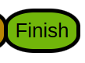|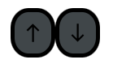|  
1. Bild
- Beendet die überarbeitung und speichert die seite genaus so wie sie ist (auch offene eingabe felder, **Noch in bearbeitung**)
2. Bild
- Verschiebt das anfokusierte Element in seinem Eltern Element hoch oder runter (beachten sie es kann auch rechts und link sein, je nach darstellung)

---
#### **Element Attribute**
Sie können den Elementen auch attribute geben und diese auch anpassen, durch die **"Attributebar"**.  
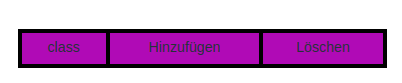  

- Hinzufügen:  
Drückt man auf hinzufügen, öffnet sich ein eingabefeld in den man den namen des neuen attribute dsa man dem fokusierten Elements hinzufügen möchte
- Löschen:  
Durch das drücken aktieviert man die Löschfunktion.  
Das nächste attribute was man anklickt wird gelöscht.  
Durch das erneute drücken wird die funktion abgebrochen.
- Attribute:  
Durch das klicken des attributes wird ein eingabefeld geöffnet in dem der wert des attributes steht.  
Den könne sie ändern, (beachten sie das die Select Elementnavigation durch die class **"fokus"** funktioniert, somit kann es zu fehlern kommen wen sie die entfernen. **"Wird behoben"** )

---
### Verzeichnis
Du kannst von hier aus neue seiten erstellen und alte verschieben und bearbeiten.  

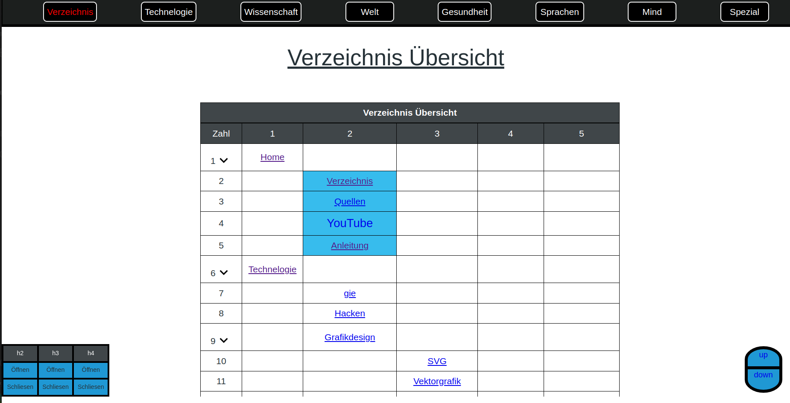
  

 #### seiten
Es gibt 2 verschiedene seiten. "Themen" und "Unterkategorien".  
|Themen|Unterkategorien|
|:-:|:-:|
|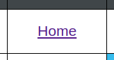|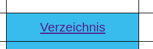|
|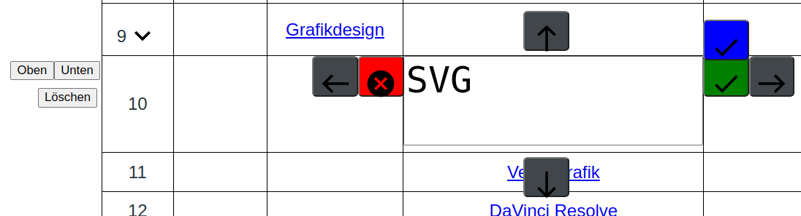|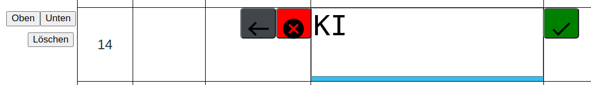|

1. Allgemein
- 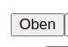Erstellt oben eine zeile für eine neue seite. must danach nur die richtige spalte aussuchen und den namen eingeben.

- 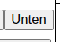Erstellt unten eine zeile für eine neue seite. must danach nur die richtige spalte aussuchen und den namen eingeben.

- 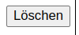Löscht die seite in dem sie in den save ordener verschoben wird.

- bricht den Vorgang ab

- 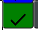Beendet die bearbeitung des verzeichnis und speichert es ab.

2. Themen 
- 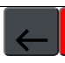rückt die seite nach rechts (Prioritet nach oben)

- 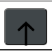rückt die seite nach oben

- 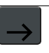rückt die seite nach links (Prioritet nach unten)

- rückt die seite nach unten

- 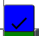Wechselt zu Unterkategorie

3. Unterkategorien
- Wechselt zu Thema
---

# Anmerkungen
Dieses Informations block war von mir nur dafür gedacht schell und übersichtlich Informationen zu speichern.  
Weshalb ich nicht ein fertiges tool anwende???  
**Weil jedes programm was ich jemals nutzte hatte ein defizieht. 
Mein Progamm ist nicht mal ansatzweiße perfekt, aber was mir nicht gefählt kann ich verändern weil es mein progamm ist.

## **Mein Ziel ist es mit diesem Programm ein multitasking tool zur Informations sammeln zu erstellen und ein intuitives nachschlage werk, ohne massen an überflussiger informationen wie wikipedia aber auch ohne langes gelabere wie in anderen webseiten. Kurz und Knackig Mein persönliches informations verzeichnis**
