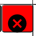

# 
Notizblock

## Vorwort

Dies ist eine Beta-Version eines Online-Blocks. Die Anwendung ist derzeit nur für den Hausgebrauch gedacht, doch in Zukunft wird sich das ändern. Der Server ist dafür gedacht, Informationen zu notieren und übersichtlich darzustellen.

## Beispiel

Dies ist nur ein Beispiel, wie es aussehen kann. Wie und mit welchen Themen Sie Ihre Seiten füllen, ist Ihnen überlassen.

---

## Aufbau

Befassen wir uns nun mit dem Aufbau.

1. Alles baut auf die oberen Kategorien und Unterkategorien auf.

- Die oberste Reihe zeigt die Hauptthemen.
Das blaue Thema ist offen.
Die unteren Reihen sind die unter Themen.

- Die Liste der Unterkategorien öffnen sich beim darüber Gehen mit der Maus über ein Thema

2. Die Informationen werden auf der Seite in Blöcken eingeschlossen.

- Diese Blöcke gib es in verschiedenen Designs und sind auf/zu klappbar. 

---

## Bearbeitung

### Seiten

#### **Start**

In dem man 3 Sekunden auf ein Element gedrückt hält, werden die Bearbeitungsfunktionen geöffnet.

---

#### **Element Selektieren**

Unten rechts sieht man die **Selectionsbar**.
|1|2|3|4|
|-|-|-|-|
|||||

1. Bild

- Im schwarzen Feld sieht man das fokussierte Element.
- Unten in Rot sieht man den "Zurück" Button um zum Elternelement zu kommen.

2. Bild

- Für den Demonstrationszwerg fokussierte ich ein anderes Element.

3. Bild

- Durch das Fokussieren auf ein Element mit Inhalt sieht man die darin befindenden Elemente
- Diese kann man durch einen Klick halb fokussieren
- Mit dem 2 Klick, auf den halb fokussierten Element kann, man es ganz fokussieren (hinein navigieren)

4. Bild

- Durch das Anklicken des "Point" Button wird das nächste Element, was angeklickt wird, fokussiert.
- Es gibt zurzeit keine Möglichkeit es abzubrechen, einmal geklickt muss es einmal ausgeführt werden. (Wird in Zukunft behoben)

---

#### **Element Erzeugung**

Die Erzeugung von Elementen wird durch eine Palette vorgefertigter Elemente zur Verfügung gestellt.

Die verschiedenen Reiter sind:  
|1|2|3|4|5|
|-|-|-|-|-|
||||||

1. Bild

- HTML:  
  Öffnet ein Eingabefeld mit dem HTML Inhalt des fokussierten Elements.
- NewElement:  
  Öffnet im Fokuselement ein Eingabefeld, in dieses, muss das Element eingegeben werden, was man erstellen möchte.
  **Falls Halbfokus aktiv ist, wird das Element über das halb fokussierte Element gesetzt.**
- CopyElement:  
  Kopiert den **HTML-Code** das fokussierten/halb-fokussierten Elements
- PasteElement:  
  Öffnet im Fokuselement ein Eingabefeld, in dieses kommt der kopierte **HTML-Code**.  
  **Falls Halbfokus aktiv ist, wird das Element über das halb fokussierte Element gesetzt.**
- delete:  
  Löscht das fokussierte/Halbfokus Element

2. Bild

- li:  
  Öffnet ein Eingabefeld in dieses, müssen sie die Anzahl eingeben der zu erzeugenden Listenelemente.
  **Falls Halbfokus aktiv ist, wird das Element über das halb fokussierte Element gesetzt.**
- td:  
  Öffnet ein Eingabefeld in dieses, müssen sie die Anzahl eingeben der zu erzeugenden Tabellenzellen Elemente.  
  **Falls Halbfokus aktiv ist, wird das Element über das halb fokussierte Element gesetzt.**
- th:  
  Öffnet ein Eingabefeld in dieses, müssen sie die Anzahl eingeben der zu erzeugenden Tabellenkopfzellen Elemente.  
  **Falls Halbfokus aktiv ist, wird das Element über das halb fokussierte Element gesetzt.**
- tr:  
  Erzeugt eine tabellen zeile.  
  **Falls Halbfokus aktiv ist, wird das Element über das halb fokussierte Element gesetzt.**
- a:  
  Erzeugt ein link und frag nach der url.  
  **Falls Halbfokus aktiv ist, wird das Element über das halb fokussierte Element gesetzt.**
- p:  
  Erzeugt ein Text Element.  
  **Falls Halbfokus aktiv ist, wird das Element über das halb fokussierte Element gesetzt.**

3. Bild

- article:  
  Erzeugt ein Hauptblock.  
  **Falls Halbfokus aktiv ist, wird das Element über das halb fokussierte Element gesetzt.**
- section:  
  Erzeugt ein block.  
  **Falls Halbfokus aktiv ist, wird das Element über das halb fokussierte Element gesetzt.**
- div:  
  Erzeugt ein Unterblock.  
  **Falls Halbfokus aktiv ist, wird das Element über das halb fokussierte Element gesetzt.**

4. Bild

- table:  
  Öffnet ein Eingabefeld in dieses, müssen sie die Anzahl eingeben der zu erzeugenden Spalten in der Tabelle.  
  **Falls Halbfokus aktiv ist, wird das Element über das halb fokussierte Element gesetzt.**
- ul:  
  Öffnet ein Eingabefeld in dieses, müssen sie die Anzahl eingeben der zu erzeugenden Listen Elemente in der unsortierten Liste.  
  **Falls Halbfokus aktiv ist, wird das Element über das halb fokussierte Element gesetzt.**
- ol:  
  Öffnet ein Eingabefeld in dieses, müssen sie die Anzahl eingeben der zu erzeugenden Listen Elemente in der sortierten Liste.  
  **Falls Halbfokus aktiv ist, wird das Element über das halb fokussierte Element gesetzt.**

5. Bild

- Methoden:  
  Erzeugt eine vorgefetigte Tabelle mit **"Methode"** als Überschrift, 4 spalten mit 4 vorgefertigten Reiter.  
  **Falls Halbfokus aktiv ist, wird das Element über das halb fokussierte Element gesetzt.**
- tabellenzeile:  
  Fügt unter der fokusierten Tabellenzeile eine neue Zeile
- tabellensalte:  
  Fügt rechts/links der fokusierten Tabellenspalte eine neue Spalte

---

#### **Element bearbeitung**

| 1                                                                                                                    | 2                                                                                                                    |
| -------------------------------------------------------------------------------------------------------------------- | -------------------------------------------------------------------------------------------------------------------- |
|  |  |

1. Bild

- Beendet die überarbeitung und speichert die seite genaus so wie sie ist

2. Bild

- Verschiebt das anfokusierte Element in seinem Eltern Element hoch oder runter (beachten sie es kann auch rechts und link sein, je nach darstellung)

---

#### **Element Attribute**

Sie können den Elementen auch attribute geben und diese auch anpassen, durch die **"Attributebar"**.  

- Hinzufügen:  
  Drückt man auf hinzufügen, öffnet sich ein Eingabefeld in den man den namen des neuen attribute dsa man dem fokusierten Elements hinzufügen möchte
- Löschen:  
  Durch das drücken aktieviert man die Löschfunktion.  
  Das nächste attribute was man anklickt wird gelöscht.  
  Durch das erneute drücken wird die funktion abgebrochen.
- Attribute:  
  Durch das klicken des attributes wird ein Eingabefeld geöffnet in dem der wert des attributes steht.  
  Den könne sie ändern, (beachten sie das die Select Elementnavigation durch die class **"fokus"** funktioniert, somit kann es zu fehlern kommen wen sie die entfernen. **"Wird behoben"** )

---

### Verzeichnis

Du kannst von hier aus neue seiten erstellen und alte verschieben und bearbeiten.

#### seiten

Es gibt 2 verschiedene seiten. "Themen" und "Unterkategorien".  
|Themen|Unterkategorien|
|:-:|:-:|
|||
|||

1. Allgemein

- Erstellt oben eine zeile für eine neue seite. must danach nur die richtige spalte aussuchen und den namen eingeben.  
  

- Erstellt unten eine zeile für eine neue seite. must danach nur die richtige spalte aussuchen und den namen eingeben.  
  

- Löscht die seite in dem sie in den save ordener verschoben wird.  
  

- bricht den Vorgang ab  
  

- Beendet die bearbeitung des verzeichnis und speichert es ab.  
  

2. Themen

- rückt die seite nach rechts (Prioritet nach oben)  
  

- rückt die seite nach oben  
  

- rückt die seite nach links (Prioritet nach unten)  
  

- rückt die seite nach unten  
  

- Wechselt zu Unterkategorie  
  

3. Unterkategorien

- Wechselt zu Thema  
  

---

# Anmerkungen

Dieses Informations block war von mir nur dafür gedacht schnell und übersichtlich Informationen zu speichern.  
Weshalb ich nicht ein fertiges tool anwende???  
\*\*Weil jedes programm was ich jemals nutzte hatte ein defizieht.
Mein Progamm ist nicht mal ansatzweiße perfekt, aber was mir nicht gefählt kann ich verändern weil es mein progamm ist.

## **Mein Ziel ist es, mit diesem Programm ein Multitasking Tool zum Information sammeln, zum Erstellen und eines intuitives nachschlage Werk, ohne Massen an überflüssigen Informationen wie Wikipedia, aber auch ohne lange umschweife wie in anderen Webseiten. Kurz und Knackig, Mein persönliches Informationsverzeichnis**
